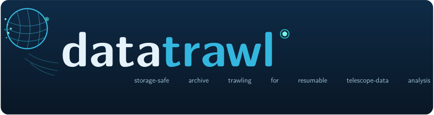
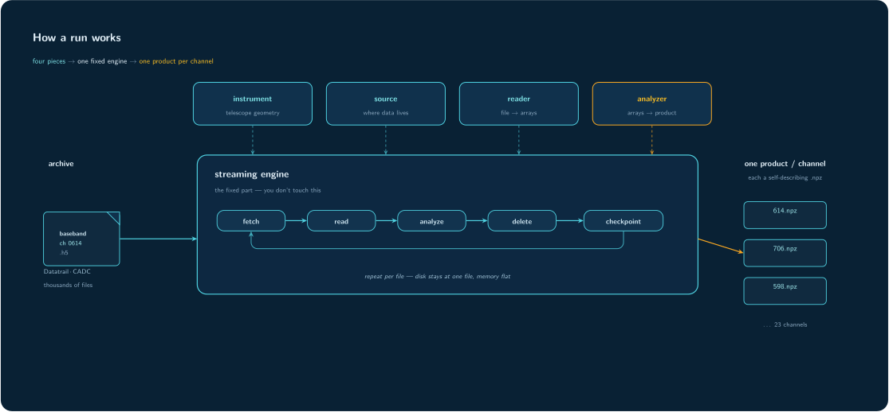

<p align="center">
  
</p>

<p align="center">
  <a href="https://github.com/WVURAIL/datatrawl/actions/workflows/tests.yml"></a>
  <a href="https://www.python.org/downloads/"></a>
  <a href="LICENSE"></a>
</p>

Storage-safe archive trawling for resumable telescope-data analysis.

*Storage-safe* means the scratch footprint is bounded: at most one staged file
exists at any time, deleted the moment it has been streamed. *Resumable* means
the product is checkpointed after every unit, so an interrupted run continues
where it stopped.

`datatrawl` is a downstream run layer for safely scanning Datatrail/CADC data
one file at a time. Datatrail remains the archive authority: it knows which
scopes exist, which datasets are registered, what storage policies apply, and how
a dataset resolves to files. `datatrawl` starts after that archive map exists. It
builds an analysis-specific inventory, verifies the expected units, stages one
file at a time, runs an analyzer, checkpoints the small product, and resumes
after CANFAR/CADC interruptions.

The science itself lives in the analyzer, which is usually your own plugin kept
in your own project.

The intended audience is CHIME/FRB users: baseband data, `freq_id`s, and
Datatrail scopes are used here without introduction.

```text
Datatrail scope(s)
    -> datatrawl survey
        -> inventory.jsonl
        -> inventory.meta.json
            -> datatrawl scan
                -> fetch one unit
                -> reader.iter_arrays(...)
                -> analyzer.consume_file(...)
                -> delete staged file
                -> checkpoint product
```

**Contents:** [The four pieces](#the-four-pieces) ·
[Install](#install) ·
[Verify the install](#verify-the-install) ·
[Worked example](#example-a-chime-single-freq_id-spectrum) ·
[Running local files](#running-local-files) ·
[Commands](#commands) ·
[Scope and non-goals](#scope-and-non-goals) ·
[Extending datatrawl](#extending-datatrawl-for-your-own-analysis) ·
[Guides](#guides) ·
[Troubleshooting](docs/TROUBLESHOOTING.md)

## The four pieces

<p align="center">
  
</p>

| Piece | Meaning |
|---|---|
| **Instrument** | Telescope geometry: band, channelization, Nyquist zone, feed count, NFFT. Pure YAML. |
| **Source** | Where the data lives and how to list + stage it, such as `cadc-datatrail` or `local`. |
| **Reader** | Converts one staged file into arrays + per-file metadata, such as `chime-baseband`. |
| **Analyzer** | The science: consumes arrays and writes a small, resumable product, such as `spectrum`. |

Plus two Datatrail terms a survey works against:

| Term | Meaning |
|---|---|
| **Scope** | Archive namespace, such as `chime.event.baseband.raw`. |
| **Dataset** | A registered name inside a scope. It may be a file-bearing dataset or a larger container. |

A survey turns scopes and datasets into a local **inventory**: a JSONL list of
verified units to scan.

## Install

```bash
git clone https://github.com/WVURAIL/datatrawl
cd datatrawl

python -m venv .venv
. .venv/bin/activate

pip install -e ".[survey,examples,dev]"
cadc-get-cert -u <your_cadc_username>
```

The `cadc-datatrail` source drives `datatrail`, which needs a one-time site
configuration before the archive example below works:

```bash
datatrail config init --site canfar
```

On CANFAR, use `--site canfar`. Elsewhere, use the site appropriate for your
environment, such as `--site local` or `--site chime`. This writes
`~/.datatrail/config.yaml`.

The offline `pytest` check and the `local` source do not need CADC or Datatrail
configuration. See [datatrail-cli](https://github.com/CHIMEFRB/datatrail-cli) for
the full Datatrail setup.

For GPU analyzers, `datatrawl` uses the CuPy your CANFAR image already ships. If
the image has no CuPy installed, run:

```bash
datatrawl setup-cupy --install
```

This detects the image's CUDA version and installs the matching wheel.

## Verify the install

The worked [CHIME spectrum example](#example-a-chime-single-freq_id-spectrum)
below runs against the real archive, so it needs the CADC certificate from the
install step. The install itself can be checked without an account:

```bash
datatrawl --version   # installed release
datatrawl list        # everything registered
datatrawl doctor      # readiness + the combinations ready to run
pytest -q             # reader -> analyzer -> checkpoint -> resume on synthetic data
```

`pytest` needs no CADC account and no data of your own, so it is the quickest
confirmation that the streaming pipeline works end to end. `make test` and
`make smoke` wrap the tests and the `list` / `doctor` checks.

## Example: a CHIME single-freq_id spectrum

This is a worked end-to-end example. It uses a single scope and a single
`freq_id`, stages a handful of files, and accumulates an averaged power spectrum.
That `freq_id` carries a known narrowband tone, a DTV pilot, at a fixed frequency.
If the tone shows up in the PSD, the whole path works:

```text
survey -> inventory -> scan -> one-file staging -> reader -> analyzer
       -> checkpoint -> resume -> plot
```

This example runs against the real archive, so it needs the CADC certificate from
[Install](#install). With no account yet, use [Verify the install](#verify-the-install)
for an offline path that exercises the same pipeline.

```text
scope:      chime.event.baseband.raw
source:     cadc-datatrail
reader:     chime-baseband
analyzer:   spectrum
selection:  freq_id 844
product:    time- and feed-averaged 2^14-point PSD
```

Build the inventory, inspect it, then run a bounded scan:

```bash
# 1. Build the inventory for a few events.
#    This records the freq_id-844 files; it does not bulk-download data.
datatrawl survey \
  --telescope chime --source cadc-datatrail \
  --scope chime.event.baseband.raw \
  --freq-ids 844 --max-events 5 --name chime-spectrum-844

# 2. Inspect the inventory without downloading bulk data.
datatrawl explore --name chime-spectrum-844

# 3. Stream + reduce a few frames from each event.
#    This is resumable and writes one product for freq_id 844.
datatrawl scan \
  --name chime-spectrum-844 --analyzer spectrum --select 844 \
  --max-frames-per-file 5
```

Plot it:

```bash
# The product is results/chime/spectrum/844.npz.
# Plotting needs matplotlib.
python - <<'PY'
import numpy as np
import matplotlib.pyplot as plt

z = np.load("results/chime/spectrum/844.npz", allow_pickle=False)

f = z["freqs_sky_hz"] / 1e6
psd_db = 10 * np.log10(z["psd"] / np.median(z["psd"]))

plt.plot(f, psd_db, lw=0.7)
plt.xlabel("sky frequency [MHz]")
plt.ylabel("power [dB re median]")
plt.title(f"CHIME freq_id {int(z['freq_id'])}: {int(z['count'])} frames")
plt.savefig("results/chime/spectrum/844.png", dpi=150)
plt.show()
PY
```

A strong narrow feature should appear in the freq_id-844 band at about
470.309 MHz. That is the pilot tone.

Re-run the identical `scan` command to verify resume. It should report that the
product is already complete.

Because this example uses `--max-frames-per-file 5`, the product is deliberately
bounded. For a later uncapped scan, remove the cap and use a fresh `--out` (or
delete the bounded product); `datatrawl` refuses to mix capped and uncapped runs.

On a headless session, such as a CANFAR script rather than a notebook cell,
`plt.show()` may do nothing. The important call is `plt.savefig(...)`.

Some of the oldest events may have aged off CADC storage. The survey reports
those as `resolved-but-empty` and skips them, so the inventory and scan proceed
on whatever is still retrievable. `rows written` can therefore be fewer than
`--max-events`; that is expected, not an error.

## Running local files

If you already have baseband `.h5` files on disk, for example staged under
`/arc`, you can run the real pipeline with no survey at all via the `local`
source:

```bash
# What is there?
datatrawl explore --source local --source-root <dir> --telescope chime

# Stage -> analyze -> checkpoint, exactly as a survey-driven scan would.
datatrawl scan --source local --source-root <dir> \
  --telescope chime --reader chime-baseband --analyzer spectrum \
  --select <freq_id> --max-frames-per-file 5
```

Without `--tmp-dir`, each invocation receives a unique scratch directory. The
base directory is chosen from `DATATRAWL_TMPDIR`, then a writable `/scratch`,
then the operating system temporary directory. Pass `--tmp-dir` when a site has
a preferred node-local scratch location. Automatically created scratch directories are removed at process exit; if a hard
kill prevents cleanup, the leftover directory is scratch and safe to delete.

By default, the local source assumes filenames contain the selected `freq_id` as
an integer before `.h5`, for example:

```text
baseband_<event>_<freq_id>.h5
```

The default matching pattern is roughly:

```text
_(\d+)\.h5$
```

For a different local naming convention, pass `--source-freq-id-regex`.

## Commands

Run any command with `--help` for its full options.

| Command | Purpose |
|---|---|
| **`datatrawl list`** | Show registered telescopes, sources, readers, and analyzers, including any loaded with `--plugin`. Start here to see what exists. |
| **`datatrawl doctor`** | Readiness check. On its own, it explains the survey/scan choices and lists ready combinations. With `--telescope ... --source ... --reader ... --analyzer ...`, it gives the prerequisite checklist for one concrete pipeline. |
| **`datatrawl survey`** | Build the run inventory: walk one or more scopes, verify expected files by metadata, omit missing ones, and cache `inventory.jsonl` + `inventory.meta.json`. It does **not** bulk-download archive data. Re-running resumes from the cache. |
| **`datatrawl survey --scopes-only`** | Recon: map the archive before committing to anything. Lists datasets across scopes (`--telescope` narrows to that telescope's live scopes; omit it to walk everything), `--match` filters by name, `--expand` opens a container one level so its children land in the map, `--name` labels the map `scopes-<name>.jsonl`. Nothing is enumerated or downloaded; every row resolves with `datatrail ps <scope> <dataset> -s`. |
| **`datatrawl explore`** | Summarize what a source holds before scanning: freq_ids present, file counts, date span, and total volume. It works on a survey inventory or a local directory. |
| **`datatrawl scan`** | Storage-safe run loop: stage one file to scratch, call the reader, call the analyzer, delete the staged file, and checkpoint the product atomically. Transient fetch failures retry on rerun; unreadable files are quarantined. |

To recover or extend a run, re-run the identical `scan` command.

## Scope and non-goals

Knowing what datatrawl deliberately does NOT do is as useful as knowing what it
does, so the boundary is stated here rather than discovered mid-design:

* **A unit is one file.** The engine stages one file, streams it through the
  reader into the analyzer, deletes it, checkpoints, and moves on. That
  invariant is what bounds scratch usage and makes every run resumable, so
  there is no mode that stages a *group* of files together.
* **datatrawl never joins data products.** It will build you a verified
  inventory per product type (survey with the right reader shape -- see
  [`docs/ADDING_A_READER.md`](docs/ADDING_A_READER.md)), but *which* companion
  file corresponds to a unit (the nearest gain solution, the covering
  calibration interval, a staleness cap) is science policy, not archive
  mechanics. That matching is your code, over the inventories --
  [`examples/match_inventories.py`](examples/match_inventories.py) is a
  worked starting point.
* **Auxiliary inputs are the analyzer's job.** An analyzer that needs a
  per-event companion (gains, flags) side-loads it itself, keyed off the
  unit's metadata -- the pattern is in
  [`docs/ADDING_AN_ANALYZER.md`](docs/ADDING_AN_ANALYZER.md#auxiliary-inputs-gains-flags-companions).
* **Selection is freq_ids and/or events, exactly.** `--select 614,706`,
  `--select 506-844`, `--select events:349382977`, or the dict form a
  `plan_runs` returns (`{"events": [...], "freq_ids": ...}`). Filters are
  ANDed and exact; nothing is inferred from the shape of a bare integer.

If your workflow fits "stream verified files one at a time into a resumable
product", datatrawl carries the archive mechanics for you. If it needs paired
bulk staging, that is a different engine, not a missing flag.

## What Datatrail does

Archive discovery -- walking scopes, listing datasets, showing the files a
file-bearing dataset carries -- is Datatrail's job, not `datatrawl`'s:

```bash
PAGER=cat datatrail ls <scope>                  # datasets in a scope
PAGER=cat datatrail ps <scope> <dataset> -s     # files in a file-bearing dataset
```

See [`docs/DATATRAIL_BOUNDARY.md`](docs/DATATRAIL_BOUNDARY.md) for what Datatrail
owns versus what `datatrawl` owns, including how containers ("larger datasets")
differ from file-bearing datasets.

## Extending datatrawl for your own analysis

`datatrawl` ships only the generic CHIME spectrum path. Your actual science
usually lives in **your** project as a plugin. You can load that plugin with:

- `--plugin`;
- the `DATATRAWL_PLUGINS` environment variable;
- a package entry point.

Nothing in this repository needs to change for project-specific analysis code.

### Which piece do I need to write?

| Your case | Write this |
|---|---|
| CHIME-compatible baseband, new science product | **Analyzer only** |
| Same files, different statistic / detector / product | **Analyzer only** |
| Files already staged on disk | Usually **analyzer only**; use `--source local` |
| Same telescope, new file format | **Reader + analyzer** |
| New Datatrail scope with a different dataset/file layout | **Source**, possibly **reader**, plus **analyzer** |
| New telescope with CHIME-like files | **Instrument YAML**, possibly **analyzer** |
| New telescope and new file format | **Instrument YAML + reader + analyzer** |

Two realistic examples:

- **An F-statistic DTV pilot detector** using the 23 pilot `freq_id`s on
  `chime.event.baseband.raw` and `chime.scheduled.baseband.raw` needs a new
  **analyzer**. The shipped `cadc-datatrail` source and `chime-baseband` reader
  already deliver the data.
- **A GBO N² burst detector** on `gbo.acquisition.processed`, using all
  `freq_id`s and looking for a short energy spike, likely needs a new
  **source**, a new **reader**, and a new **analyzer**.

### Quick path: using datatrawl from your own project

Most project-specific baseband work only needs a new analyzer, and the fastest
start is the template repository:
[**WVURAIL/datatrawl-analyzer-template**](https://github.com/WVURAIL/datatrawl-analyzer-template).
Click "Use this template", rename per its checklist, and `pip install -e .` --
the entry point in its `pyproject.toml` makes your analyzer appear in
`datatrawl list analyzers` with no `--plugin` flag. The template ships a
complete working analyzer (`freq_id-peak`: averaged PSD + peak bin, with
`--set` handling and strict resume validation) and a smoke test that runs the
real engine on synthetic data, so `pytest -q` proves the integration before
any archive access.

For ad-hoc loading without packaging, `--plugin` takes either a path to a
standalone `.py` file (which cannot use package-relative imports) or a dotted
module name from an installed project; `DATATRAWL_PLUGINS` does the same from
the environment. The loading mechanics, the preflight checklist (doctor, a
one-file smoke scan, rerun to verify resume), and the full contract live in
[`docs/ADDING_AN_ANALYZER.md`](docs/ADDING_AN_ANALYZER.md).

### Minimal analyzer shape

An analyzer subclasses `AccumulatingAnalyzer` and implements four small methods:

```python
from datatrawl.interfaces import PluginInfo
from datatrawl.analyzer_base import AccumulatingAnalyzer
from datatrawl.registry import analyzer as register_analyzer


@register_analyzer
class MyAnalyzer(AccumulatingAnalyzer):
    info = PluginInfo(name="my-analyzer", kind="analyzer", ...)

    def consume_file(self, arrays, meta): ...  # stream one staged file into state
    def _product(self): ...                    # state -> small dict, checkpointed as .npz
    def _restore(self, z): ...                 # inverse of _product, called on resume
    def summary(self): ...                     # one line for the end-of-run report
```

Parameters reach the analyzer as `ctx.options` via `--set key=value`. If an
option changes the meaning of the product (`nfft`, a detector threshold, a
window), stamp it into the product and refuse to resume when it differs.

The complete runnable example, the full contract (single pass, bounded memory,
order-dependence, fan-out), resume validation, run parameters, and auxiliary
inputs are in [`docs/ADDING_AN_ANALYZER.md`](docs/ADDING_AN_ANALYZER.md).

## Guides

| Guide | Purpose |
|---|---|
| [`docs/ADDING_AN_ANALYZER.md`](docs/ADDING_AN_ANALYZER.md) | Add the science plugin. This is the common case. |
| [`WVURAIL/datatrawl-analyzer-template`](https://github.com/WVURAIL/datatrawl-analyzer-template) | Start your own analyzer project: installable, entry-point-discovered, tested against the engine. |
| [`docs/ADDING_A_SOURCE.md`](docs/ADDING_A_SOURCE.md) | Add data from a new location, scope layout, or filesystem convention. |
| [`docs/ADDING_A_READER.md`](docs/ADDING_A_READER.md) | Add support for a new file format. |
| [`docs/ADDING_A_TELESCOPE.md`](docs/ADDING_A_TELESCOPE.md) | Add a new instrument geometry YAML. |
| [`docs/DATATRAIL_BOUNDARY.md`](docs/DATATRAIL_BOUNDARY.md) | Map a use case onto Datatrail + datatrawl responsibilities. |
| [`docs/TROUBLESHOOTING.md`](docs/TROUBLESHOOTING.md) | Long runs, self-healing, quarantine, expired certs, and recovery. |

## Design notes

`datatrawl` talks to Datatrail through the `datatrail` CLI's machine-readable
mode: the survey step runs `datatrail ls --json` and `datatrail ps --json` and
parses the structured payloads -- never the human-oriented Rich tables. That
mode is the stable public contract
[CHIMEFRB/datatrail-cli](https://github.com/CHIMEFRB/datatrail-cli) added in
0.11.0 (upstream PR #160), which resolves the `UPSTREAM NOTE` earlier
datatrawl releases carried in
[`src/datatrawl/plugins/sources/_datatrail.py`](src/datatrawl/plugins/sources/_datatrail.py):
until 0.11 the only structured surface was the internal `dtcli.src.functions`
module, which datatrawl imported directly and pinned `<0.11`.

The subprocess boundary keeps the failure classes the in-process calls
avoided: the child is `sys.executable -m dtcli.cli` (the same interpreter that
imports datatrawl, so nothing depends on a `datatrail` binary being on PATH),
parsing skips dtcli's update-available banner, and every call carries a hard
timeout (`DATATRAWL_DATATRAIL_TIMEOUT`, seconds, default 300) so a wedged
child reads as an outage -- retried, never mistaken for an
empty archive -- instead of stalling a survey worker.

## Build documentation

The formal data sheet and user guide (`docs/Datatrawl_DS001_v1_2_Data_Sheet.tex`,
`docs/Datatrawl_UG001_v1_2_User_Guide.tex`) share the WVURAIL house style with
the PilotProxy documents. Generated PDFs are ignored by git. Build locally with:

```bash
make docs        # latexmk; PDFs in docs/out/
```

The toolchain on Debian/Ubuntu (verified package set --- each package below
is required; `--no-install-recommends` with anything less fails on
`lmodern.sty`):

```bash
sudo apt-get install --no-install-recommends \
    texlive-latex-base texlive-latex-recommended texlive-latex-extra \
    texlive-fonts-recommended texlive-pictures lmodern latexmk
```

The repository graphics (architecture diagram, banner, logo, social card)
are TikZ-sourced: `assets/*.tex` are the sources of truth and the committed
`assets/*.svg` are generated from them --- wordmarks and taglines are real,
editable text, and the trawl-net mark itself lives once in
`assets/trawlmark.tikz` as a shared TikZ pic. Regenerate after editing with `make diagram` (additionally needs
`poppler-utils` for `pdftocairo`; `pip install scour` optionally shrinks the
output). CANFAR session images ship no TeX and no root, so build
documentation and diagrams locally, not in a session --- the committed SVGs
are already the `make diagram` output.

## Release history and citation

Release notes are maintained in [`CHANGELOG.md`](CHANGELOG.md). A machine-readable
software citation is provided in [`CITATION.cff`](CITATION.cff).

The package and runtime report the same version with `datatrawl --version`.
