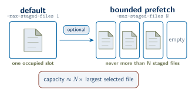
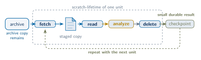
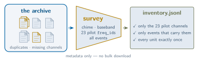
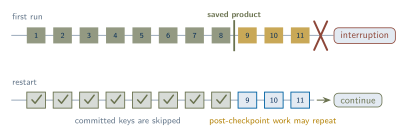
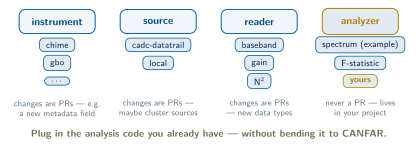

<p align="center">
  <a href="https://github.com/WVURAIL/datatrawl/actions/workflows/tests.yml"></a>
  <a href="https://www.python.org/downloads/"></a>
  <a href="LICENSE"></a>
</p>

Large archive scans create two practical problems. Staged files can fill the
available scratch space, and an interrupted session can require repeated work.
We designed `datatrawl` to bound the scratch use and preserve completed work.

By *storage-safe*, we mean that the scratch footprint has an explicit bound. By
default, one staged file exists at a time. The engine deletes that file after it
has been streamed. Raising `--max-staged-files` enables prefetching while keeping
the number of staged files bounded.

<p align="center">
  
</p>

By *resumable*, we mean that the analyzer records the unit keys committed to its
product. The engine asks it to save every `--checkpoint-every` successfully
consumed files, with a default interval of 50 files, and again at the end of a
normal run that consumed at least one new file. The supplied analyzer base class
and spectrum analyzer replace those checkpoints atomically. After an
interruption, the next run starts from the last completed checkpoint and skips
the unit keys already recorded there.

`datatrawl` operates after Datatrail has mapped the archive. Datatrail defines
the available scopes and datasets, applies the storage policies, and resolves a
dataset to its files. We use that archive map to build an analysis-specific
inventory, and the survey verifies the expected units. The engine then processes
one primary file per unit, deletes each staged copy, and checkpoints the
resulting product. Fetching can run ahead only within the
`--max-staged-files` bound.

The analyzer contains the scientific calculation. In most applications, we
keep that analyzer as a plugin in the project that uses `datatrawl`.

This documentation is written for CHIME/FRB users. We therefore use baseband
data, `freq_id`, and Datatrail scopes without a general radio-astronomy primer.

```text
Datatrail scope(s)
    -> datatrawl survey
        -> inventory.jsonl
        -> inventory.meta.json
            -> datatrawl scan
                -> fetch one unit
                -> reader.iter_arrays(...)
                -> analyzer.consume_file(...)
                -> delete staged file
                -> checkpoint product
```

<p align="center">
  
</p>

**Contents:** [The four pieces](#the-four-pieces) ·
[Install](#install) ·
[Verify the install](#verify-the-install) ·
[Worked example](#example-a-chime-single-freq_id-spectrum) ·
[Running local files](#running-local-files) ·
[Commands](#commands) ·
[Scope and non-goals](#scope-and-non-goals) ·
[Extending datatrawl](#extending-datatrawl-for-your-own-analysis) ·
[Guides](#guides) ·
[Troubleshooting](docs/TROUBLESHOOTING.md)

## The four pieces

<p align="center">
  
</p>

We separate the archive mechanics from the scientific calculation using four
pieces.

| Piece | Meaning |
|---|---|
| **Instrument** | Stores the telescope geometry in YAML: band, channelization, Nyquist zone, feed count, and NFFT. |
| **Source** | Lists and stages the data from a location such as `cadc-datatrail` or `local`. |
| **Reader** | Converts one staged file into arrays and per-file metadata, such as `chime-baseband`. |
| **Analyzer** | Consumes the arrays and writes the resumable scientific product, such as `spectrum`. |

A survey also uses two Datatrail terms.

| Term | Meaning |
|---|---|
| **Scope** | Archive namespace, such as `chime.event.baseband.raw`. |
| **Dataset** | A registered name inside a scope. It may be a file-bearing dataset or a larger container. |

A survey records the selected scopes and datasets in a local **inventory**. The
inventory is a JSON Lines (JSONL) list of the verified units available to scan.

## Install

```bash
git clone https://github.com/WVURAIL/datatrawl
cd datatrawl

python -m venv .venv
. .venv/bin/activate

pip install -e ".[survey,examples,dev]"
cadc-get-cert -u <your_cadc_username>
```

The archive example uses the `cadc-datatrail` source. This source calls
Datatrail, which requires a one-time site configuration.

```bash
datatrail config init --site canfar
```

Use `--site canfar` on CANFAR. For another environment, select its configured
site, such as `--site local` or `--site chime`. Datatrail writes this setting to
`~/.datatrail/config.yaml`. The
[datatrail-cli documentation](https://github.com/CHIMEFRB/datatrail-cli)
describes the full setup.

The offline tests and the `local` source do not require a CADC certificate or a
Datatrail configuration.

For a GPU analyzer, we use the CuPy installation supplied by the CANFAR image.
If CuPy is not installed, run:

```bash
datatrawl setup-cupy --install
```

This command detects the available CUDA major version and installs the
corresponding CuPy wheel. A scan does not install CuPy automatically.

## Verify the install

We first verify the installed package without contacting the archive. These
checks do not require a CADC account.

```bash
datatrawl --version   # installed release
datatrawl list        # everything registered
datatrawl doctor      # readiness + the combinations ready to run
pytest -q             # reader -> analyzer -> checkpoint -> resume on synthetic data
```

The test suite runs the reader, analyzer, checkpoint, and resume paths on
synthetic data. `make test` runs this suite. `make smoke` runs the `list` and
`doctor` checks.

## Example: a CHIME single-freq_id spectrum

This example tests the archive path with one scope and one `freq_id`. We stage a
small number of files and accumulate an averaged power spectral density (PSD).
The selected channel can contain a narrowband digital television (DTV) pilot.
When that feature is present, its location in the PSD provides an end-to-end
check of the inventory, staging, reader, analyzer, and frequency mapping.

```text
survey -> inventory -> scan -> bounded staging -> reader -> analyzer
       -> checkpoint -> resume -> plot
```

The example contacts the CHIME archive and therefore requires the CADC
certificate and Datatrail configuration from [Install](#install). The checks in
[Verify the install](#verify-the-install) exercise the pipeline without archive
access.

```text
scope:      chime.event.baseband.raw
source:     cadc-datatrail
reader:     chime-baseband
analyzer:   spectrum
selection:  freq_id 844
product:    time- and feed-averaged 2^14-point PSD
```

We first build the inventory, inspect it, and run a scan with bounded per-file
work.

```bash
# 1. Build the inventory for a few events.
#    This records the freq_id-844 files; it does not bulk-download data.
datatrawl survey \
  --telescope chime --source cadc-datatrail \
  --scope chime.event.baseband.raw \
  --freq-ids 844 --max-events 5 --name chime-spectrum-844

# 2. Inspect the inventory without downloading bulk data.
datatrawl explore --name chime-spectrum-844

# 3. Stream + analyze a few frames from each event.
#    This is resumable and writes one product for freq_id 844.
datatrawl scan \
  --name chime-spectrum-844 --analyzer spectrum --select 844 \
  --max-frames-per-file 5
```

<p align="center">
  
</p>

The scan writes an NPZ product. The following code plots the PSD.

```bash
# The product is results/chime/spectrum/844.npz.
# Plotting needs matplotlib.
python - <<'PY'
import numpy as np
import matplotlib.pyplot as plt

z = np.load("results/chime/spectrum/844.npz", allow_pickle=False)

f = z["freqs_sky_hz"] / 1e6
psd_db = 10 * np.log10(z["psd"] / np.median(z["psd"]))

plt.plot(f, psd_db, lw=0.7)
plt.xlabel("sky frequency [MHz]")
plt.ylabel("power [dB re median]")
plt.title(f"CHIME freq_id {int(z['freq_id'])}: {int(z['count'])} frames")
plt.savefig("results/chime/spectrum/844.png", dpi=150)
plt.show()
PY
```

For retrievable events that contain the DTV signal, a narrow feature should
appear near 470.309 MHz in the `freq_id` 844 band. This observation checks the
processing path for this configuration; it is not an absolute calibration of
the spectrum.

Re-run the same `scan` command to test resume. If the first run completed, the
second run reports that this product is already complete.

The example uses `--max-frames-per-file 5`, so the product contains only the
first five analysis frames from each file. For an uncapped scan, remove this
option and write to a new `--out`, or remove the bounded product first. The
spectrum analyzer rejects a resume that would combine capped and uncapped runs.

<p align="center">
  
</p>

In a headless CANFAR session, `plt.show()` may not display a window. The
`plt.savefig(...)` call still writes the figure.

An event can resolve in Datatrail while CADC returns none of its expected files.
This condition can be temporary, or the files may no longer be retained. The
survey leaves the event out of the inventory for that run. It reports a
nonterminal case as `resolved-but-empty` and retries that case on a later survey
until the empty-event attempt limit is reached. Therefore, `rows written` can be
smaller than `--max-events`.

## Running local files

When the baseband `.h5` files are already on disk, the `local` source can run
the same reader and analyzer without an archive survey. For example, the files
may already be staged under `/arc`.

```bash
# What is there?
datatrawl explore --source local --source-root <dir> --telescope chime

# Stage -> analyze -> checkpoint, exactly as a survey-driven scan would.
datatrawl scan --source local --source-root <dir> \
  --telescope chime --reader chime-baseband --analyzer spectrum \
  --select <freq_id> --max-frames-per-file 5
```

Without `--tmp-dir`, each scan creates a unique scratch directory. It selects
the base directory in this order: `DATATRAWL_TMPDIR`, a writable `/scratch`, and
the operating system temporary directory. Pass `--tmp-dir` when the system has
a preferred node-local scratch location. Because an explicit path is used
directly, concurrent scans must use different explicit paths.

The command removes an automatically created scratch directory when the scan
exits normally. A hard kill can leave that directory behind. This directory
contains staged scratch files and can be removed after the scan has stopped.

By default, the `local` source reads the selected `freq_id` from the final
integer before `.h5`. For example:

```text
baseband_<event>_<freq_id>.h5
```

The default regular expression is:

```text
_(\d+)\.h5$
```

Use `--source-freq-id-regex` for a different filename convention.

## Commands

Each command provides its full option list with `--help`.

| Command | Purpose |
|---|---|
| **`datatrawl list`** | Lists the registered telescopes, sources, readers, and analyzers, including plugins loaded with `--plugin`. |
| **`datatrawl doctor`** | Checks whether the requested pieces are ready. Without piece-specific options, it lists the available combinations. With `--telescope ... --source ... --reader ... --analyzer ...`, it checks one pipeline. |
| **`datatrawl survey`** | Walks one or more scopes, verifies the expected files from their metadata, and writes `inventory.jsonl` and `inventory.meta.json`. It does not bulk-download the archive files. A repeated survey uses the cached event listing; `--re-enumerate` rebuilds that listing to include newly registered events. |
| **`datatrawl survey --scopes-only`** | Maps the archive scopes and datasets before an event survey. `--telescope` limits the live scopes, `--match` filters the names, `--expand` opens each retained container by one level, and `--name` writes `scopes-<name>.jsonl`. This mode does not enumerate event files or download bulk data. File-bearing rows can be queried with `datatrail ps <scope> <dataset> -s`. |
| **`datatrawl explore`** | Reports the available `freq_id` values, file count, date span, and total volume for an inventory or local directory. |
| **`datatrawl scan`** | Stages files within the configured scratch bound, passes each unit through the reader and analyzer, deletes the staged copy, and asks the analyzer to checkpoint its product. The supplied analyzers replace those checkpoints atomically. Fetch failures remain pending for a later run. By default, unreadable files are recorded in the quarantine ledger. |

To continue a run, repeat the same `scan` command with the same product-defining
parameters.

## Scope and non-goals

We keep the engine boundary explicit because it determines which analyses fit
this execution model.

* **A unit is one primary file.** The reader and analyzer consume one unit at a
  time. The engine can prefetch independent units, but it does not exceed
  `--max-staged-files` or present several primary files as one unit. The unit key
  is the resume identity and, unless the source supplies `quarantine_key`, the
  quarantine identity.
* **The engine does not join data products.** A survey can build a verified
  inventory for each product type when the reader defines the corresponding
  file shape. See [`docs/ADDING_A_READER.md`](docs/ADDING_A_READER.md). The
  choice of companion file, such as the nearest gain solution or the covering
  calibration interval, is part of the analysis. We perform that match in the
  project code; [`examples/match_inventories.py`](examples/match_inventories.py)
  provides a worked starting point.
* **The analyzer loads auxiliary inputs.** When an analysis needs gains, flags,
  or another per-event companion, the analyzer loads that file using the unit
  metadata. The pattern is described in
  [`docs/ADDING_AN_ANALYZER.md`](docs/ADDING_AN_ANALYZER.md#auxiliary-inputs-gains-flags-companions).
* **Selections use explicit `freq_id` and event values.** Supported examples
  include `--select 614,706`, `--select 506-844`, and
  `--select events:349382977`. A `plan_runs` method can return the structured
  form `{"events": [...], "freq_ids": ...}`. The filters are combined with a
  logical AND, and a bare integer is not assigned an inferred meaning beyond the
  analyzer's selection grammar.

This engine fits analyses that stream verified one-file units into a resumable
product. An analysis that must stage several primary files as one unit requires
a different unit model.

## What Datatrail does

Datatrail provides the archive view used by `datatrawl`. It walks scopes, lists
datasets, and reports the files attached to a file-bearing dataset.

```bash
PAGER=cat datatrail ls <scope>                  # datasets in a scope
PAGER=cat datatrail ps <scope> <dataset> -s     # files in a file-bearing dataset
```

[`docs/DATATRAIL_BOUNDARY.md`](docs/DATATRAIL_BOUNDARY.md) defines the division
between Datatrail and `datatrawl`. It also distinguishes a container, which
Datatrail calls a larger dataset, from a file-bearing dataset.

## Extending datatrawl for your own analysis

`datatrawl` includes a generic CHIME spectrum analyzer. For a project-specific
calculation, we implement the scientific method as a plugin in that project.
The plugin can be loaded in three ways:

- the `--plugin` option;
- the `DATATRAWL_PLUGINS` environment variable; or
- a package entry point.

This arrangement keeps project-specific analysis code outside the `datatrawl`
repository.

The included `spectrum` analyzer is the deliberate exception: it is the
built-in example, and the only analyzer that will live in this repository.
Instrument, source, and reader additions are welcome here as pull requests;
analyzers are not merged into `datatrawl` and belong to the project that owns
the science.

### Which piece do I need to write?

| Your case | Write this |
|---|---|
| CHIME-compatible baseband, new science product | **Analyzer only** |
| Same files, different statistic / detector / product | **Analyzer only** |
| Files already staged on disk | Usually **analyzer only**; use `--source local` |
| Existing event/file shape in a new Datatrail scope | Usually **analyzer only**; reuse the source/reader and pass `--scope` |
| Event-keyed Datatrail product with a new file shape | **Reader + analyzer**; reuse `cadc-datatrail` |
| Non-event-keyed archive layout or different listing/staging policy | **Source**, probably **reader**, plus **analyzer** |
| New telescope with CHIME-like files | **Instrument YAML**, possibly **analyzer** |
| New telescope and new file format | **Instrument YAML + reader + analyzer** |

Two examples show how we apply this division.

- **An F-statistic DTV pilot detector** over the 23 nominal pilot positions in
  `chime.event.baseband.raw` and `chime.scheduled.baseband.raw` needs a new
  **analyzer**. The included `cadc-datatrail` source and `chime-baseband` reader
  already provide the required archive and file-format paths.
- **A GBO N² burst detector** on `gbo.acquisition.processed`, using all
  `freq_id` values to test for a short energy increase, requires a new
  **analyzer**. If its archive layout and file format differ from the included
  CHIME baseband path, it also requires a new **source** and **reader**.

<p align="center">
  
</p>

### Quick path: using datatrawl from your own project

Most project-specific baseband analyses require only an analyzer. The
[**WVURAIL/datatrawl-analyzer-template**](https://github.com/WVURAIL/datatrawl-analyzer-template)
provides an installable starting point. Select "Use this template," follow its
renaming checklist, and run `pip install -e .`. The entry point in
`pyproject.toml` then registers the analyzer with `datatrawl list analyzers`
without a `--plugin` option.

The template includes the `freq_id-peak` analyzer. It computes an averaged PSD
and its peak bin, accepts parameters through `--set`, and validates those
parameters on resume. Its smoke test runs the engine on synthetic data. Thus,
`pytest -q` can test the plugin integration before archive access.

For an unpackaged test, `--plugin` accepts either a standalone `.py` path or a
dotted module from an installed project. A standalone file cannot use
package-relative imports. The `DATATRAWL_PLUGINS` environment variable provides
the same loading choices. [`docs/ADDING_AN_ANALYZER.md`](docs/ADDING_AN_ANALYZER.md)
describes the loading rules, the preflight checks, a one-file scan, resume
testing, and the analyzer contract.

### Minimal analyzer shape

An accumulating analyzer subclasses `AccumulatingAnalyzer` and implements the
accumulator and lifecycle methods. The following example computes the mean
power over the streamed frames.

```python
import numpy as np

from datatrawl.interfaces import PluginInfo, RunContext
from datatrawl.analyzer_base import AccumulatingAnalyzer
from datatrawl.registry import analyzer as register_analyzer


@register_analyzer
class MeanPowerAnalyzer(AccumulatingAnalyzer):
    info = PluginInfo(
        name="mean-power",
        kind="analyzer",
        summary="Accumulate mean power from streamed arrays.",
        instruments=("*",),
    )

    def __init__(self):
        super().__init__()
        self._sum = 0.0
        self._count = 0

    def begin(self, ctx: RunContext, first_meta):
        # Capture run metadata here if needed; never reset resumed state.
        pass

    def consume_file(self, arrays, meta):
        n = 0
        for array in arrays:
            self._sum += float(np.mean(np.abs(array) ** 2))
            self._count += 1
            n += 1
        self._record(meta)  # required for checkpoint/resume bookkeeping
        return n

    def _product(self):
        return {"analysis": "mean-power", "sum": self._sum, "count": self._count}

    def _restore(self, z):
        if str(z["analysis"]) != "mean-power":
            raise SystemExit("existing product belongs to a different analyzer")
        self._sum = float(z["sum"])
        self._count = int(z["count"])

    def summary(self):
        mean = self._sum / self._count if self._count else 0.0
        return {"frames": self._count, "mean_power": mean}
```

The engine passes `--set key=value` parameters to the analyzer through
`ctx.options`. When a parameter changes the meaning of the product, such as a
detector threshold or window, we record that parameter in the product. The
analyzer must reject a resume when the recorded value differs.

[`docs/ADDING_AN_ANALYZER.md`](docs/ADDING_AN_ANALYZER.md) provides the runnable
example and the complete contract. It covers single-pass accumulation, bounded
memory, input ordering, product fan-out, resume validation, run parameters, and
auxiliary inputs.

## Guides

| Guide | Purpose |
|---|---|
| [`docs/ADDING_AN_ANALYZER.md`](docs/ADDING_AN_ANALYZER.md) | Implements a new scientific calculation. This is the usual extension. |
| [`WVURAIL/datatrawl-analyzer-template`](https://github.com/WVURAIL/datatrawl-analyzer-template) | Starts an installable analyzer project with entry-point discovery and engine tests. |
| [`docs/ADDING_A_SOURCE.md`](docs/ADDING_A_SOURCE.md) | Connects a new data location, scope layout, or filesystem convention. |
| [`docs/ADDING_A_READER.md`](docs/ADDING_A_READER.md) | Adds support for a new file format. |
| [`docs/ADDING_A_TELESCOPE.md`](docs/ADDING_A_TELESCOPE.md) | Defines a new instrument geometry in YAML. |
| [`docs/DATATRAIL_BOUNDARY.md`](docs/DATATRAIL_BOUNDARY.md) | Assigns archive and execution responsibilities to Datatrail and `datatrawl`. |
| [`docs/TROUBLESHOOTING.md`](docs/TROUBLESHOOTING.md) | Diagnoses long runs, quarantine records, expired certificates, and interrupted-run recovery. |
| [`docs/CLI_OUTPUT.md`](docs/CLI_OUTPUT.md) | Interprets `doctor`, `survey`, `explore`, and `scan` output in SSH, `tmux`, `nohup`, and CANFAR logs. |

## Design notes

`datatrawl` calls the machine-readable Datatrail commands,
`datatrail ls --json` and `datatrail ps --json`, through datatrail-cli 0.11 or
later. We spawn these commands from the same Python interpreter that imports
`datatrawl`. Each call has a timeout set by
`DATATRAWL_DATATRAIL_TIMEOUT`, with a default of 300 s.

When a call times out or returns a malformed response, the adapter classifies
the result as an unavailable archive response rather than an empty dataset. The
adapter in
[`src/datatrawl/plugins/sources/_datatrail.py`](src/datatrawl/plugins/sources/_datatrail.py)
defines this interface. Its module documentation gives the design rationale,
and [`CHANGELOG.md`](CHANGELOG.md) records the migration history.

## Build documentation

The formal data sheet and user guide are
`docs/Datatrawl_DS001_v1_3_Data_Sheet.tex` and
`docs/Datatrawl_UG001_v1_3_User_Guide.tex`. We use the same WVURAIL document
style for these files and the PilotProxy documents. Git ignores the generated
PDFs. Build them locally with:

```bash
make docs        # latexmk; PDFs in docs/out/
```

The following Debian/Ubuntu package set produced both documents in our tested
environment:

```bash
sudo apt-get install --no-install-recommends \
    texlive-latex-base texlive-latex-recommended texlive-latex-extra \
    texlive-fonts-recommended texlive-pictures lmodern latexmk
```

The architecture diagram, banner, logo, and social card are generated from the
TikZ sources in `assets/*.tex`. The wordmarks and taglines remain editable text.
The shared trawl-net mark is defined once in `assets/trawlmark.tikz`. After a
source edit, run `make diagram` to regenerate the committed SVG files. This
target requires `pdftocairo` from `poppler-utils`. Installing `scour` with pip
is optional and reduces the SVG file size.

The tutorial slide deck lives in `docs/presentation/` and builds with
`make slides` (LuaLaTeX; see `docs/presentation/README.md` for the package
list). The `assets/fig-*.tikz` figure bodies are shared: the deck inputs them
directly, and `make diagram` renders the same sources into the README's
committed `assets/fig-*.svg` files, so a figure edited once updates both.

The CANFAR images used for this project did not provide TeX or root access. We
therefore build the documents and diagrams in a local environment and commit
the generated SVG files.

## Release history and citation

We record release changes in [`CHANGELOG.md`](CHANGELOG.md) and provide the
software citation metadata in [`CITATION.cff`](CITATION.cff).

The installed package reports its runtime version with `datatrawl --version`.
